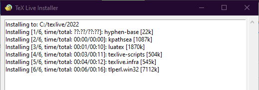

# Install LaTeX

## Contents
- [ArchLinux](#archlinux)
	+ [TeXLive](#texlive)
	+ [TeXStudio](#texstudio)
	+ [Visual Studio Code](#visual-studio-code)
	+ [Makefile](#makefile)
- [Windows](#windows)
	+ [TeXLive](#texlive-1)
	+ [TeXStudio](#texstudio-1)

## ArchLinux

Example install command for ArchLinux, Manjaro, or any other Arch-based GNU/Linux distributions OS.

### TeXLive

To install TeXLive package, you can use command:

```sh
sudo pacman -S texlive-most texlive-bin latex2html latex2rtf dblatex minted biber pdftk
```

It will download approximately 800MB and installation size about 2.5GB.

This should be reproducible in other GNU/Linux distributions like Ubuntu or Fedora.

### TeXStudio

For editor, you can choose TeXStudio and can be installed using command:

```sh
sudo pacman -S texstudio
```

Installation size approximately 500MB (including Qt5 toolkit)


**NOTE:** If you use **minted**, you should use **-shell-escape**.
 
 Go to menu *Options* -> *Configure TexStudio* -> *Commands* to add **-shell-escape** like this:.
 

 
### Visual Studio Code

You can also use general code editor like Visual Studio Code to write LaTeX document.

First install VSCodium from this AUR package: https://aur.archlinux.org/packages/vscodium-bin/


Then install **LaTeX-Workshop** extension from *View* -> *Extension*.

### Makefile

You can also use this **Makefile** to build PDF from LaTeX documents

```make
TEXCC=pdflatex
BIBCC=bibtex
TEXFLAGS=-shell-escape -synctex=1 -interaction=nonstopmode
TEXFILE=$(shell basename --suffix=.tex $$(ls -1 *.tex))

# '-' sign mean keep going even if the command fail
all:
	-$(TEXCC) $(TEXFLAGS) $(TEXFILE).tex
	-$(BIBCC) $(TEXFILE).aux
	-$(TEXCC) $(TEXFLAGS) $(TEXFILE).tex
	-$(TEXCC) $(TEXFLAGS) $(TEXFILE).tex # run twice to update ToC/BibTeX

clean:
	rm -f *.out *.bbl *.blg *.lof *.lot *.nav *.vrb
	rm -f *.log *.toc *.synctex.gz  *.pyg *.snm
	rm -f *.aux *Notes.bib
	rm -f *.pdf
	rm -rf ./_minted*
```

Save as Makefile in same directory of any LaTeX documents, then run command:

```sh
make all
```

and to clean up you can run commmand:

```sh
make clean
```

## Windows

Example install process for Windows OS.

### TeXLive

Here step to Download TeXLive package:
- Open Mirror CTAN: https://ctan.org/mirrors.
- Choose closest mirror. Then choose **TeX Live**.
- Choose **Images**. Click to download the ISO file.

For example, Indonesian users can use this ISO file URL:

http://repo.ugm.ac.id/ctan/systems/texlive/Images/texlive2022-20220321.iso

**NOTE:** The ISO file approximately 5GB.

After download the ISO, first mount the ISO file (for example here as **E:** drive)

<p align="middle">
  
   
</p>

Then open **CMD** to run these commands:

```sh
> E:
> install-tl-windows.bat --location "E:/"
```

**NOTE:** Leave the CMD Window open during installations process


When GUI installer shown up, choose *Advanced*


Here there some recommended adjustments:
- Check *Adjust searchpath*.
- Choose *All* for *File associations*.
- Uncheck *Install TeXWorks* since TeXStudio will be used here.


Next go to *Selections* and click *Customize*.


In *Language* part, click *None* and then check only *US and UK English*


Then Click *Apply* and *OK*. The installation size should be reduced.


Last, click *Install* and wait until finished.

<p align="middle">
  
   
</p>

### TexStudio

You can download the Windows binary from Github release page:

https://github.com/texstudio-org/texstudio/releases/


**NOTE:** If you use **minted**, you should use **-shell-escape**.
 
 Go to menu *Options* -> *Configure TexStudio* -> *Commands* to add **-shell-escape** like this:.
 
